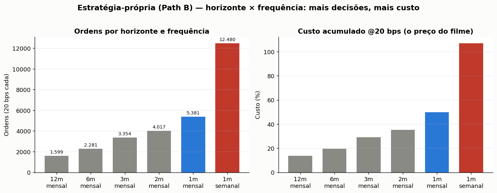

# Estratégia-própria — book E59 (130/30 clássico, sem CDI)

Momentum cross-sectional em universo amplo (Path B · 145 ações). Versão de jul/2026.

## Regra

| Item | Escolha |
|---|---|
| Sinal | Momentum de **1 mês** (calendário) |
| Frequência | **Semanal** (último pregão da semana) |
| Long | Top 20 · equal weight · soma **+130%** (6,5% por nome) |
| Short | Bottom 10 · equal weight · soma **−30%** (−3% por nome) |
| Caixa / CDI | **0** — não entra no PnL |
| Custo | 20 bps por ordem |
| Execução | Sinal em *t* → PnL a partir de *t+1* (`shift(1)`) |

**130/30 de verdade:** o short de 30% financia os 30% a mais de long. Líquido em ações ≈ 100%, gross ≈ 160%. Não é "mais de 100% por mágica"; e **não** carrega carry de juros (o CDI foi aposentado do book — a comparação passou a ser relativa, ação vs ação).

## Resultado (série exportada do motor do lab)

| Métrica | Valor |
|---|---|
| Retorno líquido | +126% |
| Sharpe (vs zero, secundário) | 0,44 |
| Max drawdown | −71% |
| Rebalances / ordens | 519 / 12 480 |
| Exposição long / short / caixa | 1,30 / −0,30 / 0 |

Janela 2016-08 → 2026-07. Blocos: 2016–19 **+256%** (Sharpe 1,70) · 2020–22 **−41%** (−0,44) · 2023–26 **+8%** (0,22). O gross maior (160%) aprofunda o drawdown vs uma versão 100% long — é o preço honesto do 130/30.

Série: [`dados/saidas/estrategia_propria_diario.csv`](dados/saidas/estrategia_propria_diario.csv). Reproduzir métricas: `python3 estrategia_propria.py`.

## Por que este desenho

Horizontes mais curtos produzem mais decisões no mesmo universo — o que importa quando o objetivo é estudar o **sinal** e, depois, aprender sobre essas decisões (seguir / reduzir / recusar). A frequência semanal multiplica os rebalances em relação à mensal, mantendo o horizonte de 1 mês. Sharpe **não** é o critério — o alvo é densidade de decisões com um book minimamente bom.

## Painel de decisões (em relabel)

Cada nome no Top20/Bottom10, a cada sinal, é uma decisão `(ticker, data, lado)` — ~519 sinais × 30 nomes. Essas decisões são a matéria-prima do metalabel (o modelo que decide **seguir ou ignorar** cada decisão do sinal).

O rótulo **muda** com a decisão de aposentar o CDI: a régua antiga (`perna vs CDI`) saiu. O rótulo passa a ser **relativo** (uma perna vs a outra) — o eixo exato está em definição. Por isso o painel rotulado antigo (base CDI) não é publicado aqui; o relabel relativo é a etapa seguinte.

## Limites (declarados)

Universo Path B ≠ as três ações da Rotação v2 / Dual Momentum. O short é alocação de carteira; execução real exige borrow/locate (não modelados). Survivorship: Path B são vivos com cobertura completa 2021–2022 — os retornos herdam esse viés (declarado no lab). Código de referência da regra: [`src/estrategia_propria.py`](src/estrategia_propria.py) · pseudocódigo: [docs/pseudocodigo/base_amostra_e59.md](docs/pseudocodigo/base_amostra_e59.md).
