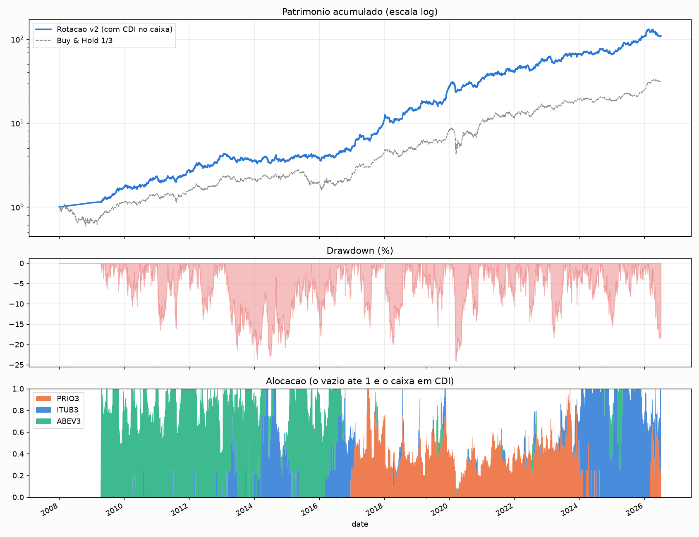

# Quant Momentum — Rotação Dinâmica

Estratégia sistemática de **momentum cross-sectional com volatility targeting**, aplicada a três ações brasileiras (ITUB3, PRIO3, ABEV3) com dados desde 2008. A cada dia o sistema aloca o capital no ativo de maior momentum, dimensiona a posição pela volatilidade e rotaciona quando outro assume a liderança. Long-only, sem alavancagem, líquido de custos.

## Resultados (desde 2008, líquido de custos)

| Estratégia | Sharpe | Sortino | Max Drawdown | Retorno |
|---|---|---|---|---|
| **Rotação** | **1,09** | **1,58** | **−26%** | **+3.257%** |
| Buy & Hold (1/3 cada) | 0,83 | 1,15 | −52% | +3.017% |



## Como rodar

```bash
pip install -r requirements.txt
python3 rotacao_graf.py      # estratégia + gráfico (patrimônio / drawdown / alocação)
python3 rotacao.py           # apenas as métricas (núcleo)
```

Requer a pasta `dados/` com os CSVs no formato `date, open, high, low, close, adjustedClose, volume`.

## Estrutura

| Arquivo | Conteúdo |
|---|---|
| `rotacao.py` | Núcleo da estratégia (vetorizado) |
| `rotacao_graf.py` | Estratégia + gráfico |
| `dados/` | Preços ajustados dos três ativos |
| `requirements.txt` | Dependências (pandas, numpy, matplotlib) |

Stack: Python · pandas · numpy · matplotlib.
