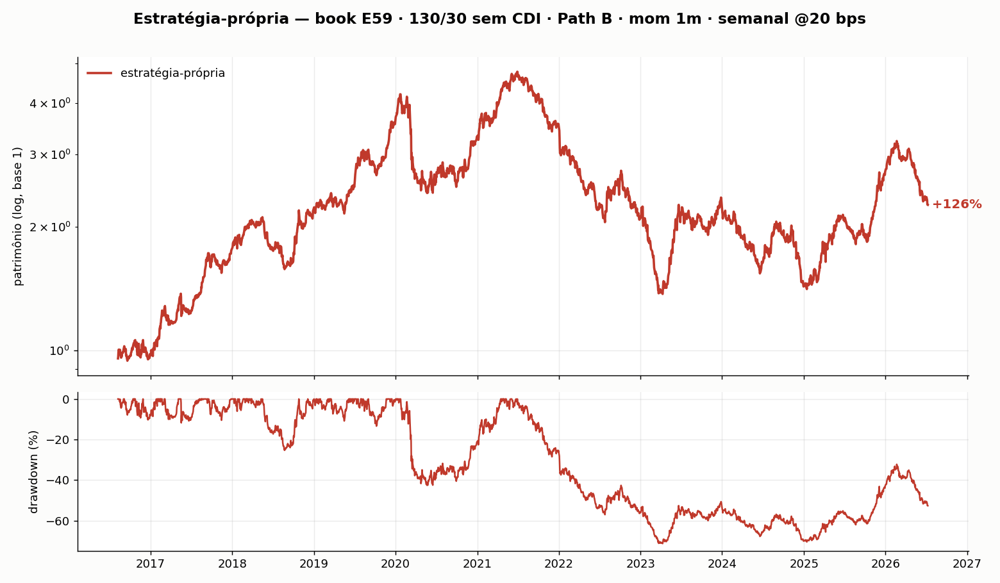
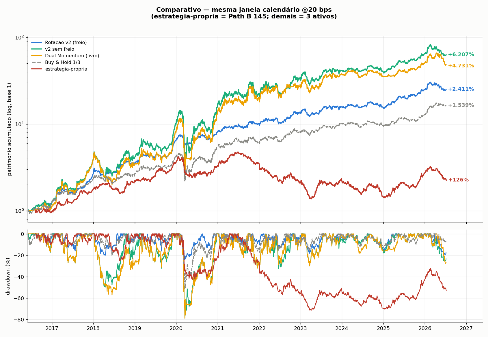

# Quant Research

Pesquisa quantitativa em ações brasileiras: duas linhas apresentadas neste repositório. Versão jul/2026.

1. **Rotação Momentum v2** e **Dual Momentum** — universo de três ativos (ITUB3, PRIO3, ABEV3).
2. **Estratégia-própria** — momentum cross-sectional em universo amplo (Path B, 145 ações), **130/30 long/short, sem CDI**.

Tudo líquido de **20 bps por ordem**, sem look-ahead (`shift(1)`). Os baselines de 3 ativos usam CDI por fidelidade ao livro (caixa da v2; barreira absoluta do Dual Momentum); a **estratégia-própria E59 não usa CDI** — a comparação é relativa, ação vs ação.

---

## Estratégia-própria (universo amplo) — book E59

Cross-section de momentum no Path B (145 ações com histórico contínuo na janela operacional). A cada **semana**, o sistema:

- mede o momentum de **1 mês** (calendário) de cada ação elegível;
- compra equally-weighted o **Top 20** — soma **+130%** (6,5% por nome);
- vende equally-weighted o **Bottom 10** — soma **−30%** (−3% por nome);
- **sem CDI / sem caixa** (o short de 30% financia os 30% a mais de long: 130/30 clássico);
- executa no pregão seguinte ao sinal; custo **20 bps** por ordem.

| Métrica | Valor |
|---|---|
| Universo | Path B · 145 ações |
| Sinal | Momentum 1 mês |
| Rebalance | Semanal |
| Carteira | +130% Top20 / −30% Bottom10 / caixa 0 |
| Ordens / rebalances | 12 480 / 519 |
| Retorno líquido* | +126% |
| Sharpe* (secundário) | 0,44 |
| Max drawdown* | −71% |

\*Série diária em `dados/saidas/estrategia_propria_diario.csv` (2016-08 → 2026-07), exportada do motor canônico do lab (ramo E59, `contrib_cdi = 0`). Reproduzir: `python3 estrategia_propria.py`.

Blocos: 2016–19 **+256%** (Sharpe 1,70) · 2020–22 **−41%** (−0,44) · 2023–26 **+8%** (0,22). O gross ≈ 160% aprofunda o drawdown vs uma versão 100% long — é o preço honesto do 130/30.

**Por que 1 mês e frequência semanal.** Testamos horizontes de 1 a 12 meses (e 2 meses) com o mesmo veículo. Horizontes mais curtos geram **mais decisões** — material mais rico para validar o sinal e, depois, para aprender sobre essas decisões. A versão semanal multiplica rebalances no mesmo horizonte de 1 mês. Sharpe **não** é o critério; o alvo é densidade de decisões com um book minimamente bom. Detalhe e pseudocódigo: [docs/pseudocodigo/base_amostra_e59.md](docs/pseudocodigo/base_amostra_e59.md) · visão rápida: [ESTRATEGIA_PROPRIA.md](ESTRATEGIA_PROPRIA.md).

**Contagem de decisões (base publicada):**

| Objeto | N |
|---|---:|
| Sinais de carteira (rebalances semanais) | **519** |
| Decisões por nome (Top20+Bottom10 por sinal) | **15 570** |
| Ordens de execução (compra/venda @20 bps) | **12 480** |




**Liquidez.** Auditoria nos nomes escolhidos: nenhum slot sem volume relevante. A regra **não** filtra nem repondera por liquidez (orientação do mentor: não mexer nisso).

**Painel de decisões (em relabel).** Cada posição do Top20/Bottom10 em cada sinal é uma decisão — matéria-prima do metalabel (seguir/ignorar). O rótulo migrou de `perna vs CDI` para **relativo** (uma perna vs a outra); o eixo exato está em definição, então o painel rotulado antigo (base CDI) não é publicado. Detalhe: [docs/pseudocodigo/painel_decisoes.md](docs/pseudocodigo/painel_decisoes.md).

---

## Comparativo (mesma janela de calendário)

Régua diária, ativas @20 bps. **Atenção:** a estratégia-própria usa universo Path B; as demais usam só três ações. O gráfico alinha datas, não o painel.

| Estratégia | Universo | Sharpe | Vol | Max DD | Retorno |
|---|---|---|---|---|---|
| **Rotação v2 (com freio de vol)** | 3 ativos | **1,56** | 22% | **−24%** | +2.411% |
| v2 sem freio | 3 ativos | 1,09 | 50% | −79% | +6.207% |
| Dual Momentum (livro) | 3 ativos | 1,03 | 50% | −79% | +4.731% |
| Buy & Hold 1/3 | 3 ativos | 1,17 | 27% | −52% | +1.539% |
| **Estratégia-própria (E59)** | Path B 145 | 0,44 | 28% | −71% | +126% |



---

## Rotação Momentum v2 (3 ativos)

Momentum cross-sectional com **volatility targeting** e rebalance semanal em ITUB3, PRIO3 e ABEV3. Três camadas: **direção** (média dos líderes em 6/9/12/15 meses), **tamanho** (vol alvo 20% a.a. no portfólio) e **ritmo** (pesos congelados por uma semana). Caixa rende CDI. Long-only, sem alavancagem.

**Amostra longa (`rotacao.py`, desde 2008, warm-up E37):** Sharpe **1,18** | MaxDD **−28%** | retorno +6.740%.

O freio de volatilidade é o que separa a v2 do Dual Momentum clássico no comparativo (vol ~22% vs ~50%). Não confundir o Sharpe 1,56 (janela ~2016+) com o 1,18 da amostra 2008+.


### Sinais: v2 × Dual Momentum mensal


---

## Dual Momentum (apresentado)

Núcleo do livro intacto (momentum **12 meses** + barreira CDI dos mesmos 12 meses), avaliado a cada barra de **60 minutos**, com histerese de **5%** na troca de líder.

| Versão | Sharpe | MaxDD | Retorno | Trocas |
|---|---|---|---|---|
| **Dual Momentum** (`dual_momentum.py`, 60min) | **1,13** | −64% (horária) | **+4.931%** | 20 de líder · 127 do caixa |
| Dual Momentum mensal (baseline) | 1,04 | −65% mensal (−79% diária) | +3.858% | 18 meses com troca |


---

## Pseudocódigos

Narrativa em português para apresentação oral, linha a linha:

- [Rotação v2](docs/pseudocodigo/rotacao_v2.md)
- [Dual Momentum](docs/pseudocodigo/dual_momentum.md)
- [Estratégia-própria (E59)](docs/pseudocodigo/base_amostra_e59.md)
- [Painel de decisões (em relabel)](docs/pseudocodigo/painel_decisoes.md)
- Índice: [docs/pseudocodigo/](docs/pseudocodigo/)

Metodologia (escolha de horizonte/frequência): [docs/metodologia_estrategia_propria.md](docs/metodologia_estrategia_propria.md).

---

## Como rodar

```bash
pip install -r requirements.txt
python3 rotacao.py                     # Rotação v2 (3 ativos)
python3 dual_momentum.py               # Dual Momentum 60min
python3 dual_momentum_mensal.py        # baseline mensal
python3 estrategia_propria.py          # métricas do book E59 (própria)
python3 comparativo.py                 # figures/comparativo.png
python3 estrategia_propria_graf.py     # figures/estrategia_propria.png + horizontes_path_b.png
python3 rotacao_graf.py                # figures/rotacao.png
python3 src/dual_momentum_graf.py      # figures/dm_vs_benchmark.png
python3 src/sinais_comparados.py       # figures/sinais_comparados.png
```

## Estrutura

```
├── README.md · ESTRATEGIA_PROPRIA.md
├── src/                 # código das estratégias (atalhos na raiz apontam para cá)
├── dados/
│   ├── brutos/          # entradas cruas: preços 3 ativos, base 60min, CDI do BCB
│   └── saidas/          # evidência gerada: série E59, filme de horizontes
├── figures/             # gráficos do README
└── docs/pseudocodigo/   # narrativa linha a linha
```

Stack: Python, pandas, numpy, matplotlib.
